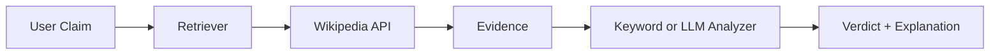

# Wikipedia Fact Checker 📰🤖

[](https://github.com/pawankonwar/wikipedia-fact-checker/actions/workflows/test.yml)

**An AI system that verifies claims using Wikipedia to ensure factual accuracy.**

---

## Why This Project Exists

LLMs can hallucinate facts, and verifying information manually is slow. This project demonstrates **retrieval-augmented verification**: combine structured retrieval (Wikipedia API) with optional **LLM reasoning** to check factual claims and return verdicts, evidence, and explanations.

---

## High-Level Architecture



**Flow:** Query → Retriever (Wikipedia) → Evidence extraction → Analyzer (keyword or LLM) → Verdict + confidence + explanation.

---

## Core Capabilities

- **Retrieval** — Search and fetch relevant Wikipedia articles; configurable timeouts, rate-limit handling.
- **Dual analyzers** — **Keyword mode** (rule-based) or **LLM mode** (OpenAI/Ollama) for semantic verification.
- **LLM reasoning** — Evaluate claim accuracy from evidence; natural-language explanations and confidence scores (0–100).
- **Structured output** — Verdicts: **TRUE**, **FALSE**, **MIXED**, **INSUFFICIENT_EVIDENCE**; export to JSON/CSV; history in UI.

---

## Example Interaction

**Input:** *"Albert Einstein won the Nobel Prize in 1922 for General Relativity."*

**Output (LLM mode):** *FALSE. Einstein won the Nobel Prize in Physics in 1921 for the photoelectric effect, not General Relativity.* (with confidence and cited evidence)

---

## Tech Stack

- **Python 3.8+** — Type hints, logging, config-driven design
- **Wikipedia API** — Retrieval and evidence extraction
- **OpenAI API / Ollama** — LLM verification and explanations
- **Streamlit** — Web UI; export and history
- **pytest** — Tests with mocked API (CI-ready)

---

## Quick Start

```bash
git clone <repo-url>
cd wikipedia-fact-checker
pip install -r requirements.txt
```

**Keyword mode (no API key):**

```bash
streamlit run app.py
# or
python fact_checker.py
```

**LLM mode (OpenAI):** Add `.env` with `OPENAI_API_KEY=sk-...`, then set `analyzer_mode: "llm"` in `config.yaml` or choose **LLM** in the Streamlit sidebar.

**LLM mode (Ollama):** Install [Ollama](https://ollama.com), run `ollama pull llama3.2`, set `llm.provider: "ollama"` in `config.yaml`.

---

## Configuration & Usage

| Item | Description |
|------|-------------|
| **Config** | `config.yaml` — Wikipedia API, analyzer mode, LLM provider/model, export, logging |
| **Web UI** | `streamlit run app.py` — Claim input, verdict, evidence, export (JSON/CSV), history |
| **CLI** | `python fact_checker.py` — Interactive; uses `config.yaml` analyzer mode |
| **API** | `WikipediaFactChecker().run_fact_check_with_analyzer(claim)` or `run_multi_claim_fact_check(claims)` |

---

## Project Structure

| Path | Role |
|------|------|
| `fact_checker.py` | Wikipedia client, keyword analyzer, `run_fact_check` / `run_fact_check_with_analyzer` / multi-claim |
| `llm_analyzer.py` | LLM analyzer (OpenAI/Ollama), semantic verdict, explanation, confidence, citations |
| `config.py` / `config.yaml` | Load and validate config; typed helpers |
| `export_results.py` | Export to JSON/CSV |
| `app.py` | Streamlit UI |
| `tests/test_fact_checker.py` | Pytest with mocked Wikipedia API |

---

## What This Demonstrates

- **RAG-style verification** — Retrieve from Wikipedia, then verify with rules or LLM.
- **Explainable outputs** — Verdict + evidence + explanation + optional confidence.
- **Production-minded design** — Config-driven, type hints, error handling, logging, tests, CI (GitHub Actions).

---

## Testing

```bash
pytest tests/ -v
```

Mocked Wikipedia API; covers all verdict types and API error handling. No network required.

---

## Future Enhancements

- Multi-source verification beyond Wikipedia
- Confidence calibration and evaluation metrics
- Optional web scraping / additional retrievers

---

## License

MIT License — see [LICENSE](LICENSE).
